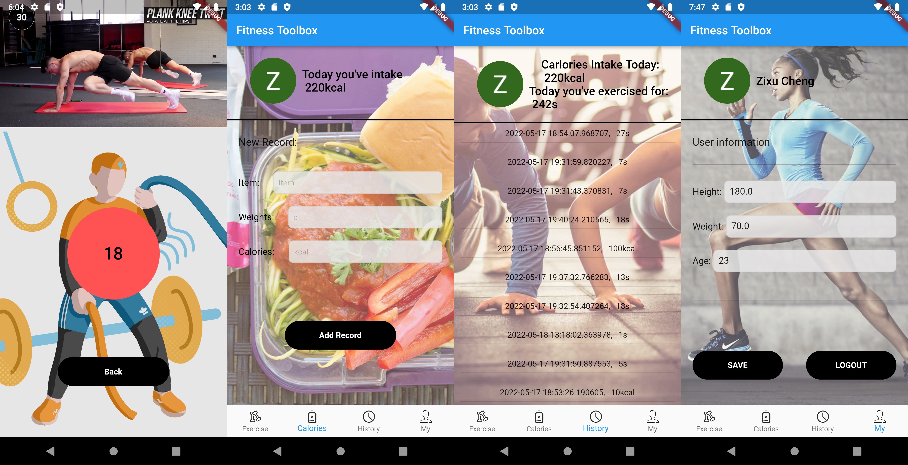

# Fitness Toolbox

As people pay more and more attention to their physical health and diets intake, some fitness apps are getting increasingly popular. Fitness Toolbox integrates some useful tools and functions in some fitness apps into one app. It’s easier for a fitness beginner to use.

This app is convenient for those fitness beginner who who don’t want to go to the gym and just want to do some simple freehand exercises at home. It integrates three types of exercise in one app, including workout training, yoga and meditation, and help you easily record your training duration and calorie intake.

## Screenshot Previews




## Features

##### Splash page & Login page:

* The splash page will show for 3s after starting the app.
* In the login page, I chose [google sign in platform interface](https://pub.dev/packages/google_sign_in_platform_interface) for user login and authentication.
* You can login directly with your google account. No needs to register for a new account, increasing its practicality.


##### Exercise Page:

* A general information about your exercise duration is shown on the top of the page.
* You can see various tutorial video lists by tapping different columns, including workout training, yoga and meditation.
* The background image will change as the video list switches.
* All these videos are downloaded from YouTube and store on [my Github.io](https://github.com/Cheng-Zixu/cheng-zixu.github.io). All videos will only be used for teaching purposes, please contact me to remove if any infringement.


##### Tutorial Page

* This page is used to play the tutorial video and record your exercise history.
* The tutorial video you chose would be shown on the top.
* A timer gradually increases to record the time you spent on training.
* When you click back, the training data will be record and save in your history page and store in [firebase cloud store](https://pub.dev/packages/cloud_firestore).


##### Calorie Page

* This page contains a simple calorie calculator which could help you record your daily calorie intake.
* A general information about your daily calorie intake is shown on the top of the page.
* You need to manually input the item, weights and calories about the food you ate today.
* After you press the ‘add record’ button, your daily calorie intake will be saved on firebase and shown in history page.


##### History Page

* This page shows all your history records about daily calorie intake and exercise duration.
* A general information about your daily calorie intake and exercise duration is shown on the top of the page.
* All your history records will be simply shown in list.


##### User Page

* This page saves your personal information about height, weight and age, as well as getting your user id and photo from your google account.
* You can manually modify your user information and it will be saved on firebase.
* You can logout here and the app jumps to login page.


## Getting Started

### 1. [Setup Flutter](https://flutter.io/setup/)

### 2. Clone the repo

```
$ git clone https://github.com/Cheng-Zixu/CASA-0015-Fitness-Toolbox.git
$ cd CASA-0015-Fitness-Toolbox
```

### 3. Setup the firebase app

1. You'll need to create a Firebase instance. Follow the instructions at [https://console.firebase.google.com](https://console.firebase.google.com/).
2. Once your Firebase instance is created, you'll need to enable anonymous authentication.

- Go to the Firebase Console for your new instance.
- Click "Authentication" in the left-hand menu
- Click the "sign-in method" tab
- Click "Google" and enable it

3. Enable the Firebase Database

- Go to the Firebase Console
- Click "Database" in the left-hand menu
- Click the Cloudstore "Create Database" button
- Select "Start in test mode" and "Enable"

4. (skip if not running on Android)

- Create an app within your Firebase instance for Android, with package name com.zixucheng.fitness_toolbox
- Run the following command to get your SHA-1 key:

```
keytool -exportcert -list -v \
-alias androiddebugkey -keystore ~/.android/debug.keystore
```

- In the Firebase console, in the settings of your Android app, add your SHA-1 key by clicking "Add Fingerprint".
- Follow instructions to download google-services.json
- place `google-services.json` into `/android/app/`.

5. (skip if not running on iOS)

- Create an app within your Firebase instance for iOS, with your app package name
- Follow instructions to download GoogleService-Info.plist
- Open XCode, right click the Runner folder, select the "Add Files to 'Runner'" menu, and select the GoogleService-Info.plist file to add it to /ios/Runner in XCode
- Open /ios/Runner/Info.plist in a text editor. Locate the CFBundleURLSchemes key. The second item in the array value of this key is specific to the Firebase instance. Replace it with the value for REVERSED_CLIENT_ID from GoogleService-Info.plist

6. Double check install instructions for both

- Google Sign in Platform Interface Plugin
  - https://pub.dev/packages/google_sign_in_platform_interface
- Firestore Plugin
  - https://pub.dartlang.org/packages/cloud_firestore

## How to Contribute

1. Fork the the project
2. Create your feature branch (git checkout -b my-new-feature)
3. Make required changes and commit (git commit -am 'Add some feature')
4. Push to the branch (git push origin my-new-feature)
5. Create new Pull Request

## Contact me

email: ucfnzc1@ucl.ac.uk
